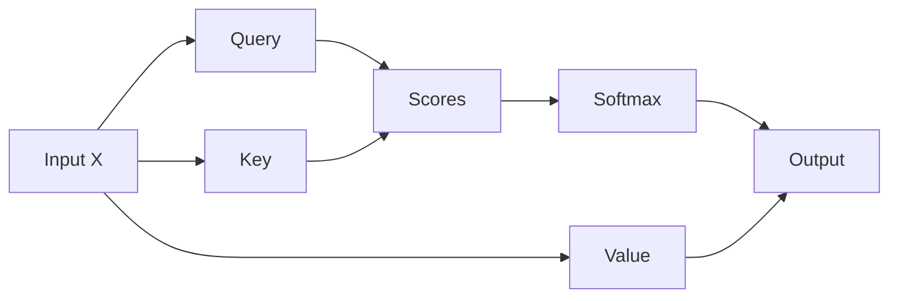

# 从零实现 Self-Attention

> 这是一份 Markdown Card M2/M3 教程写作测试素材，不是功能支持声明。
> 它故意包含重复中文标题、嵌套代码围栏、Mermaid、相对资源和内部链接，
> 用于发现导入、编辑、导航、保存与导出过程中的损失或降级。
>
> 当前实现的建议手测路径：通过 **File → Open Markdown…** 打开本文件，先用
> `⇧⌘O` 检查 Outline，再用 `⇧⌘M` 检查 Source/Rich 往返，用 `⌘F` / `⌥⌘F`
> 查找替换，最后用 `⌘S` 写回临时副本。完整步骤和快捷键冲突用例见
> [`MarkdownWritingM2M3TestPlan.md`](MarkdownWritingM2M3TestPlan.md)。
>
> 当前实现应覆盖离线 Mermaid、脚注往返、点击安全相对源码链接、图片
> caption/width/alignment 扩展、表头/对齐/TSV、Source 格式快捷键、版本历史与有序
> 系列导出，以及 Rich 中安全单标题重命名后的 fragment 修复。仍需单独记录的限制是：
> 多标题/结构性或 Source 重命名不会猜测链接身份，图片 Choose File 尚未实现
> （Paste/文件拖放已实现），系列导出会携带安全图片但不携带普通相对源码链接，
> Rich 编辑不承诺 byte-minimal diff。

## 目录

- [1. 张量形状](#1-张量形状)
- [2. Python 实现](#2-python-实现)
- [3. 架构图](#3-架构图)
- [4. 复杂度与工程取舍](#4-复杂度与工程取舍)
- [重复标题](#3-架构图-1)

## 1. 张量形状

设输入为 $X \in \mathbb{R}^{B \times T \times D}$，其中 $B$ 是 batch size，
$T$ 是序列长度，$D$ 是隐藏维度。Query、Key 和 Value 由三个线性投影得到：

$$
Q=XW_Q,\qquad K=XW_K,\qquad V=XW_V
$$

Scaled dot-product attention 定义为：

$$
\operatorname{Attention}(Q,K,V)
=\operatorname{softmax}\left(\frac{QK^\mathsf{T}}{\sqrt{d_k}}+M\right)V
$$

> 注意：padding mask 和 causal mask 都应在 softmax 之前应用。[^mask]

## 2. Python 实现

下面的实现刻意使用 `python3` 语言名，便于检查语言别名和源码往返是否被改写：

```python3
import math

def attention(q, k, v, mask=None):
    scores = q @ k.transpose(-1, -2) / math.sqrt(q.shape[-1])
    if mask is not None:
        scores = scores.masked_fill(mask == 0, float("-inf"))
    weights = scores.softmax(dim=-1)
    return weights @ v
```

教程有时需要展示“代码块里还有代码块”。下面使用四反引号包住含三反引号的
Markdown 示例，导入和导出后仍应保持为一个完整代码块：

````markdown
```python
print("nested fence")
```
````

实现源码位于[相对源码链接](./src/attention.py#L12)，公式说明可跳回
[张量形状](#1-张量形状)，外部背景资料可参考
[Attention Is All You Need](https://arxiv.org/abs/1706.03762)。

### Source 快捷键沙盒

切到 Source 后，只选择每行冒号后的单词再执行指定快捷键；每次操作后先撤销，避免
后一个用例受到前一个影响。

- `⌘B`：bold-target
- `⌘I`：italic-target
- `⌘E`：code-target（测试前在 `target` 中间手工插入一个反引号）
- `⌘K`：link-target
- `⌘0`–`⌘6`：heading-target
- `⇧⌘S`：strike-target

`⌘E` 行的测试选区应故意含有反引号；命令应选择足够长的行内代码定界符，且一次
`⌘Z` 应完整恢复变换前的源码。

## 3. 架构图

Mermaid 源码应能够在“源码”和“预览”之间切换；即使渲染失败，也不能丢失源码：



下面的相对图片不会随本 fixture 一起生成。测试时请在同级目录创建
`assets/attention-flow.png` 和安全的 `assets/attention-flow.svg`，用于验证文档根
目录内资源解析：

{caption="图 1：Self-Attention 数据流" width="75%" align="center"}


图片编辑器应允许修改 source、alt、title、caption、25/50/75/100% 宽度与对齐；其中
花括号属性是 Markdown Card 的可逆扩展，不是标准 GFM。

## 3. 架构图

这个标题故意与上一节重复，用于验证 slug 去重、Outline 定位和内部链接更新。
若作者重命名这一节，既不应跳到上一节，也不应静默破坏已有链接。

## 4. 复杂度与工程取舍

| Stage | Input | Output | Shape | Complexity | Notes |
| :--- | :---: | ---: | :--- | ---: | :--- |
| Projection | $X$ | $Q,K,V$ | $B\times T\times D$ | $O(BTD^2)$ | Three linear layers |
| Scores | $Q,K$ | $S$ | $B\times T\times T$ | $O(BT^2D)$ | Quadratic in sequence length |
| Softmax | $S+M$ | $P$ | $B\times T\times T$ | $O(BT^2)$ | Apply mask first |
| Weighted sum | $P,V$ | $O$ | $B\times T\times D$ | $O(BT^2D)$ | Memory bandwidth sensitive |

在 Sticky 布局中，六列都应可通过表格自身横向滚动到达。作者还应能添加或删除
行列、切换表头、设置对齐，并把制表符分隔的数据粘贴成表格。

---

## 验收尾句

请保留这句直到最后：`M2/M3 fixture end — 中文输入、保存、恢复与导出均需覆盖。`

[^mask]: Causal mask 阻止 token 看到未来位置；padding mask 排除补齐位置。
