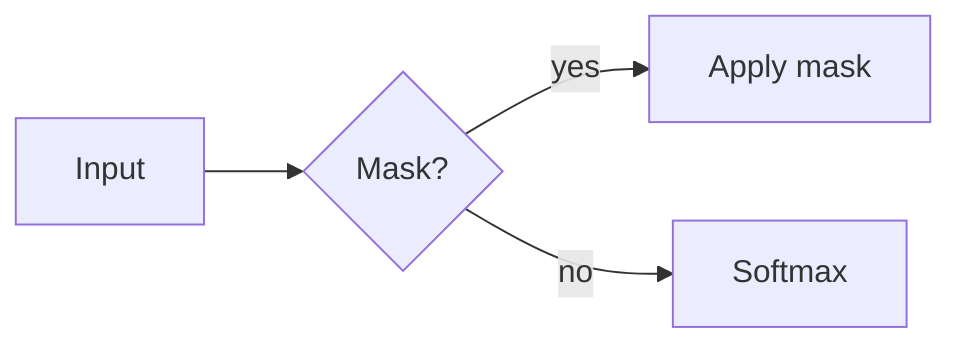

# Markdown 写作体验 M2/M3 验收计划

这份计划用于开发和验收 Markdown Card 的长篇 CS 教程写作能力。它同时包含
**当前实现回归**与**后续目标用例**；先对照下方实现矩阵，再判断失败是回归还是
已知差距。不要把目标用例误写成当前功能声明，也不要把已知差距误判为 M1 回归。

主测试素材为
[`CSTutorialAuthoringFixture.md`](CSTutorialAuthoringFixture.md)。建议使用独立的 QA 卡、
临时文档目录或隔离数据存储，避免修改正式卡片和仓库文件。

## 自动化回归

在项目根目录执行：

```bash
cd /path/to/markdown-card
(cd Renderer && npm run check)
swift test --disable-sandbox
./Scripts/integration_test.sh
codesign --verify --deep --strict --verbose=2 "dist/Markdown Card.app"
git diff --check
```

全部命令应以退出码 `0` 完成。若 `swift test` 在受限终端中提示 module cache
或 Unix socket 权限错误，应换到普通 Terminal 重跑；这类环境错误不代表产品逻辑失败。

涉及文件绑定、外部冲突、IME、VoiceOver 和输入延迟的用例不能只由 jsdom 或 Swift
单元测试代替，必须在正式构建或同构的隔离 QA App 中手测。

## 准备相对资源测试目录

以下目录只用于测试，完成后可删除：

```bash
mkdir -p /tmp/markdown-card-m2m3/assets /tmp/markdown-card-m2m3/src
cp Examples/CSTutorialAuthoringFixture.md /tmp/markdown-card-m2m3/tutorial.md
cp Resources/AppIcon.png /tmp/markdown-card-m2m3/assets/attention-flow.png
cp Renderer/src/sample.js /tmp/markdown-card-m2m3/src/attention.py
printf '%s\n' '<svg xmlns="http://www.w3.org/2000/svg" viewBox="0 0 320 120"><title>Attention flow</title><rect x="1" y="1" width="318" height="118" rx="12" fill="#eef4ff" stroke="#356ae6"/><text x="160" y="68" text-anchor="middle">Q · K · V → Attention</text></svg>' > /tmp/markdown-card-m2m3/assets/attention-flow.svg
printf '%s\n' '<svg xmlns="http://www.w3.org/2000/svg" viewBox="0 0 20 20"><script>alert(1)</script><rect width="20" height="20"/></svg>' > /tmp/markdown-card-m2m3/assets/active.svg
```

额外准备以下图片，分别验证正常、超高、超大和动画预算路径：

- `attention-flow.png`：1600×900、1–2 MiB PNG。
- `tensor-shapes@2x.png`：3200×1800、约 6 MiB PNG。
- `tall-terminal.png`：宽度正常但高度大于 8192px。
- `compressed-huge.png`：两边不超过 8192px，但总像素超过 4000 万。
- `17mb-noise.png`：大于 16 MiB。
- `animated-demo.gif`：至少两帧。
- `too-many-frames.gif`：超过 120 帧，或累计解码像素超过 1 亿。

## 当前实现矩阵

以下行为应按回归处理，失败即记录缺陷：

| 范围 | 当前应可用 |
| --- | --- |
| M2 写作 | Rich/Source 往返；未触碰 Rich 文档的 Copy/Export 保留原字节；Rich 与 Source 内 Find/Replace；H1–H6 Outline；Unicode/重复标题 fragment 跳转；单标题安全重命名时同一 undo 修复内部链接；嵌套 fence 安全序列化；离线 Mermaid 与脚注；Source 格式快捷键；表头/列对齐/TSV；图片 source/alt/title/caption/width/alignment；完整 IME guard；90 ms Rich 编辑合并刷新 |
| M2 文档资源 | 绑定文件后渲染同目录树内 PNG/JPEG/GIF/WebP/受限安全 SVG；点击 root-confined 相对源码链接及行号/标题 fragment；阻止绝对路径、`..`、symlink 越界、远程、active SVG 或无效资源；保留原 Markdown |
| M3 文件 | Open `.md`/`.markdown`；`⌘S` 原子写回；`⌥⌘S` portable Save As 并重新绑定；安全复制托管附件与相对图片、稳定处理重名且不覆盖现有文件；绑定跨启动保留；标题栏显示文件名与 `Edited`；4 MiB UTF-8 上限 |
| M3 冲突与恢复 | Save 时用摘要识别磁盘变化，不静默覆盖；提供 **Reload File**、**Compare…**、**Save As…**、**Keep Mine…**；Keep Mine 二次确认并先保存磁盘历史；最多 50 个版本、比较/恢复、较新快照启动恢复 |
| M3 系列 | 新系列默认 newest-first；按 tag 持久化显式章节顺序；验证文内/本地/跨卡 fragment；导出 Markdown 与 namespaced chapter 图片资源，报告未解析图片和普通相对文件链接 portability warning |
| 快捷键 | 启动迁移旧冲突绑定；录制器拒绝 Markdown/固定 File/布局保留键并给出原因与替代；聚焦编辑器时 Markdown 优先，离焦时不格式化正文 |

以下仍是探索/后续目标，当前失败应记录为“已知差距”，不要宣称通过：

- 图片 Choose File 按钮尚未实现；Paste、文件拖放和图片 source 替换已实现。
- 文件实时监听与可编辑的双栏 merge；当前 Compare 是只读行比较。
- 系列导出不会携带普通相对文件/源码链接；安全图片会按 chapter namespace 复制和改写。
- Rich 编辑后的 byte-minimal diff；Source 仍是 whitespace-sensitive 内容的首选。

Source/Rich 不编辑往返保留原始 payload；一旦 Source textarea 被编辑，换行按浏览器
规则归一为 LF。需要检查未知语法或尽量减少无关 diff 时，应优先在 Source 中手测并
对比保存前后文件。Rich 编辑保证 Markdown 语义序列化，不承诺 byte-minimal Git diff。

## M2：教程作者能力

| ID | 场景 | 操作 | 目标行为 |
| --- | --- | --- | --- |
| M2-01 | Outline 建立 | 打开主 fixture，展开 Outline | 按 H1–H6 层级列出标题；当前章节清楚；Outline 不进入导出 Markdown |
| M2-02 | 中文与重复标题跳转 | 分别选择两个“3. 架构图”，再点击目录 fragment | 两个标题生成稳定、唯一的目标；每次都跳到正确章节并把焦点留在合理位置 |
| M2-03 | 标题重命名 | 在 Rich 中只把第二个“3. 架构图”改成“3. KV Cache 架构图”，检查目录链接并撤销；再一次改两个标题 | 单标题及重复 suffix 的内部链接与标题在同一 undo 中迁移；一次改多个标题时不猜测、不误改，并显示可访问 warning；Source 重命名需人工更新链接 |
| M2-04 | Source/Rich 往返 | 切到 Source 不编辑即切回；再分别在 Source 与 Rich 只改一个段落并 diff | 无操作时原 payload byte-exact；Source 只产生预期局部变化（编辑后换行按 LF）；Rich 保留未触及 code fence/info 等节点，但只承诺语义序列化，不把整篇 byte-minimal 当通过条件 |
| M2-05 | 嵌套代码 fence | 定位到四反引号代码块，进入/退出并改变语言 | 内部三反引号不提前关闭外层代码块；导出后可被标准 Markdown 解析器重新解析 |
| M2-06 | 代码语言 | 把 `python3` 改为 `python`，再改成未知语言 `cuda-kernel` | 语言入口可发现；已注册语言高亮；未知语言不瞎猜且原名可导出 |
| M2-07 | 公式编辑 | 修改行内公式、块公式和 `aligned`/矩阵公式，再输入一个无效公式 | 有效公式离线渲染；错误位置与原因可理解；无效源码不会消失 |
| M2-08 | 六列表格 | 在 fixture 表格中新增列、删除行、设置数字列对齐，并粘贴 TSV | 结构操作可撤销；Sticky 中所有列可达；Copy/Export 得到合法 GFM 表格 |
| M2-09 | Mermaid | 在源码和预览间切换；制造语法错误后修复 | 有效图离线渲染；错误不执行脚本、不联网、不丢源码；导出仍保留 Mermaid fence |
| M2-10 | 图片插入入口 | 分别用 Paste、文件拖放插入图片，再寻找 Choose File 入口 | Paste/拖放都在落点生成可撤销的托管结果；Choose File 当前未实现，记录为已知差距 |
| M2-11 | 图片元数据 | 编辑替代文本、图注和显示尺寸，再替换原图 | 元数据可键盘访问；替换不丢图注；导出路径与 Markdown 语义清楚 |
| M2-12 | 图片失败反馈 | 插入超高/超像素图、17 MiB 图、损坏图和超预算 GIF | 不静默失败；明确说明尺寸、容量、格式或动画预算；原文和选择不被破坏 |
| M2-13 | 三类链接 | 测试外链、`#1-张量形状` 和 `./src/attention.py#L12` | 外链交给系统；fragment 在文内跳转；相对链接只解析到允许的文档根目录 |
| M2-14 | 脚注与引用 | 新增脚注、从正文跳到脚注再回跳 | 编号稳定、键盘可达；导出后仍为可移植 Markdown；删除引用不会留下孤儿状态 |

## M3：文件生命周期、长文与恢复

| ID | 场景 | 操作 | 目标行为 |
| --- | --- | --- | --- |
| M3-01 | Open 与 Save Back | 从 `/tmp/markdown-card-m2m3/tutorial.md` 打开，改一段后 Save | 卡片明确显示文件绑定状态；只写回该文件；没有额外格式 diff |
| M3-02 | Portable Save As | 将文件另存到已有同名资源的新目录 | 新文件成为当前绑定；安全资源被复制；同字节复用、异字节用稳定后缀改写引用且绝不覆盖现有文件 |
| M3-03 | 重新打开 bundle | 关闭卡片并重新打开 `.md + assets/` | 相对图片恢复；不依赖旧的全局附件数据库；缺失资源显示可操作错误 |
| M3-04 | 仅磁盘修改 | App 内不编辑，用其他编辑器改变一段，再按 `⌘S` | Save 时提示磁盘已变，不自动覆盖；Reload File 后显示磁盘版本；实时监听仍是后续目标 |
| M3-05 | 双向修改冲突 | App 内保留未保存修改，同时从终端修改同一文件，再按 `⌘S` | 不静默覆盖；**Reload File**、只读 **Compare…**、**Save As…**、二次确认 **Keep Mine…** 四种结果可预测 |
| M3-06 | 保存状态 | 连续输入后观察标题栏，再保存、隐藏、切卡和导出 | 绑定文件名先显示 `Edited`，成功 Save 后恢复干净；离开和文件操作都会 flush 最新编辑；更细的 Saving/Error 状态仍是后续目标 |
| M3-07 | 异常恢复 | 在隔离数据中输入验收尾句后强制终止 QA App，再重开 | 若存在比持久卡更新且内容不同的快照，启动时自动采用；没有单独恢复弹窗；精确时序以单元测试为准 |
| M3-08 | Undo 与版本边界 | 编辑、切卡、返回，再尝试撤销；打开 Version History 恢复旧版 | Undo 不跨卡；版本恢复先快照当前内容，恢复后仍可再次找回新版本 |
| M3-09 | 100KB 长文 | 在文档头部、中部、末尾连续输入、删除和撤销 | 无吞字、光标跳动或明显冻结；输入到绘制 p95 小于 50ms |
| M3-10 | 1MB 长文 | 重复上一步并滚动 Outline、切 Source/Rich、保存和导出 | 输入到绘制 p95 小于 100ms；无单次冻结超过 500ms；保存内容完整 |
| M3-11 | 大文档边界 | 逐步接近并超过产品允许大小 | 在达到上限前预警；不因一次编辑让文档进入无法保存或导出的状态 |
| M3-12 | 系列编译 | 将多张同标签卡显式排序、验链并合并成一个教程 | 顺序、目录和 chapter marker 明确；安全图片进入 namespaced sibling assets；普通相对文件链接显示 portability warning；单卡不被改写 |

## 生成 100KB 与 1MB 长文

下面的命令写入 `/tmp`，不会修改仓库：

```bash
python3 -c 'from pathlib import Path; block=lambda i: f"## Section {i}\n\nParagraph {i} with **bold**, `inline code`, $x_{i}=i^2$, and [link](https://example.com/{i}).\n\n```python\nprint({i})\n```\n"; Path("/tmp/mdcard-100kb.md").write_text("# QA 100KB\n\n"+"\n".join(block(i) for i in range(750)), encoding="utf-8")'
python3 -c 'from pathlib import Path; block=lambda i: f"## Section {i}\n\nParagraph {i} with **bold**, `inline code`, $x_{i}=i^2$, and [link](https://example.com/{i}).\n\n```python\nprint({i})\n```\n"; Path("/tmp/mdcard-1mb.md").write_text("# QA 1MB\n\n"+"\n".join(block(i) for i in range(7500)), encoding="utf-8")'
wc -c /tmp/mdcard-100kb.md /tmp/mdcard-1mb.md
```

测试时记录文档字节数、标题数、机器型号、布局、主题、是否开启 Source/Outline，
以及输入到绘制延迟的 p50、p95、最大值。不要只记录序列化耗时，因为用户感知还包含
编辑事务、WebView 绘制、跨进程传输和 native 持久化。

## 外部冲突测试

1. 复制 fixture 到临时目录并通过 Open Markdown 打开。
2. 在 App 中修改“验收尾句”，暂时不要手动保存。
3. 在普通文本编辑器中修改同一行并保存。
4. 回到 App 按 `⌘S`，确认出现 **Reload File**、**Compare…**、**Save As…**、**Keep Mine…**，
   而不是直接覆盖文件。
5. 先选 **Compare…**：只读视图中磁盘删除行以 `−` 开头、卡片新增行以 `+` 开头；
   Back 后应回到同一冲突选择器，不写任何文件。
6. 每次从干净临时副本重做冲突，分别验证其余三个结果；Save As 应改绑新文件；
   Keep Mine 必须再点 **Overwrite with Card**，先把磁盘版写入版本历史，再以卡片覆盖；
   Reload File 应采用磁盘内容。
7. 在冲突提示出现后继续修改卡片，再选择 Reload File，确认 reload guard 不会
   用旧冲突快照覆盖提示后产生的新编辑。
8. Keep Mine 二次确认前再次从外部改文件，确认出现新的冲突而不是覆盖第三版磁盘内容。
9. 检查最终文件、卡片内容、版本历史、undo 和标题栏 `Edited` 状态，不得出现静默覆盖。

冲突测试必须使用临时副本；不要对正式仓库文件或用户笔记制造并发写入。
当前版本在 Save 时检查冲突，不实时监听磁盘；Compare 是只读行比较，不是可编辑 merge。

## 相对图片与安全边界

在 `/tmp/markdown-card-m2m3/tutorial.md` 中依次测试：

```markdown


```

目标行为：

- 只允许文档根目录内、通过 native 校验的相对资源进入渲染管道。
- `..` 越界、任意 `file://` 和远程资源继续被阻止，且不可泄露真实文件内容。
- 阻止状态要保留原始 Markdown 并显示不可用原因；“选择文件”“重新定位”等恢复
  动作仍是后续目标。
- 不应为了显示相对图而放宽 WebView 的任意网络或本地文件权限。

## 快捷键冲突与焦点作用域

快捷键所有权按“当前焦点”决定：只有焦点位于该卡片的 WebView、Rich/Source
编辑器或 WebView 内写作面板时，Markdown 命令才会执行。焦点在标题栏、native
控件、Card Library、Settings 或其他 App 时，不得意外格式化卡片内容。

最终映射：

| 范围 | 快捷键 | 预期 |
| --- | --- | --- |
| Rich | `⌘0` | 转为段落 |
| Rich | `⌘1`–`⌘6` | 切换 H1–H6，不改变卡片布局 |
| Rich | `⌘B` / `⌘I` / `⌘E` / `⌘K` | 粗体 / 斜体 / 行内代码 / 链接 |
| Rich | `⇧⌘S` | 删除线，不打开 Save As |
| Source | `⌘B` / `⌘I` / `⌘E` / `⌘K` | 包裹/切换粗体、斜体、行内代码、链接语法 |
| Source | `⌘0`–`⌘6` / `⇧⌘S` | 改写段落/标题、包裹删除线；一次变换一次 Undo |
| Rich + Source | `⌘F` / `⌥⌘F` | Find / Find and Replace |
| Rich + Source | `⇧⌘M` / `⇧⌘O` | Rich–Source / Outline |
| Rich 表格 | `⌃Return` | 聚焦当前列把手，不改变 Tab 单元格导航 |
| 活跃卡片窗口 | `⌃1`–`⌃5` | Mini / Sticky / Middle / Full Screen / Custom |
| 活跃卡片文件 | `⌘S` / `⌥⌘S` | Save / Save As |

Source 是原始 textarea，但实现了常用 Markdown 语法变换。选区内含反引号时，`⌘E`
会增长 delimiter；`⌘K` 插入 `[label](https://)` 并选中目标；标题命令按所选行处理。
这些命令和 Rich 一样只在编辑器聚焦时拥有优先级，且组合输入期间不得执行。

| ID | 操作 | 预期 |
| --- | --- | --- |
| KEY-01 | Rich 中选一段普通文本，依次按 `⌘0`、`⌘1`…`⌘6` | 段落/H1–H6 正确切换；窗口 frame 与 layout 不变 |
| KEY-02 | Rich 中按 `⌃1`…`⌃5` | 布局依次改变；正文块类型和 Markdown 不变；Full Screen 临时出现 Dock/App Switcher 身份并降为普通窗口层级，退出后恢复悬浮；旧 `⌃⌘1`…`⌃⌘5` 不再触发布局 |
| KEY-03 | Rich 中选中文字按 `⇧⌘S`，再按 `⌥⌘S` | 第一次只加删除线；第二次只打开 Save As |
| KEY-04 | Rich 与 Source 分别按 `⌘F`、`⌥⌘F` 搜索并替换 | 两种模式都可查找；Replace All 结果完整；Rich 中一次 Undo 撤销全部替换 |
| KEY-05 | Rich 与 Source 分别按 `⇧⌘O`，用上下键和 Return 选标题 | Outline 层级一致；跳到当前模式的对应位置；Esc 只关 Outline |
| KEY-06 | 按 `⇧⌘M` 往返但不编辑，再编辑 Source 最后一个字符并保存 | 无编辑往返保留原 payload；编辑后最后字符不丢，textarea 换行按 LF 保存 |
| KEY-07 | 打开 Link、Find、Outline、图片编辑器，各按一次 Esc；再按一次 Esc | 第一次只关闭当前写作面板并回到编辑器；无写作面板时才隐藏卡片 |
| KEY-08 | 把焦点移到卡片标题/布局按钮，再按 `⌘1`、`⇧⌘S` | 不格式化正文，也不触发布局或 Save As；`⌃1` 仍执行布局 |
| KEY-09 | 在 Source 中选中 raw text，依次按 `⌘B`、`⌘1`、`⇧⌘S`，每次后按一次 `⌘Z` | 分别包裹 `**`、改为 `#`、包裹 `~~`；每次一次 Undo 完整恢复；不触发窗口功能 |
| KEY-10 | Settings → Shortcuts 尝试录入 Markdown、固定 File、布局或重复组合 | 录制器拒绝，保留先前有效配置，并显示精确原因与可用替代键；VoiceOver 可播报 |
| KEY-11 | 从含旧 `⌘L` Card Library 默认和冲突自定义绑定的旧版 QA 配置升级 | 启动只迁移一次；优先换到首个未冲突候选，否则禁用；Settings 显示每项迁移结果 |
| KEY-12 | Rich/Source 聚焦、标题栏聚焦、切到其他 App 时分别按同一 Markdown 组合 | 仅前两种编辑器聚焦状态格式化；标题/其他 App 不改正文；固定 Save/Save As/布局始终不被旧绑定抢走 |
| KEY-13 | 在 Rich/Source 中文候选窗仍处于组合态时按布局键和已配置的 Fold/Move；确认候选后再按 | 组合态不改变布局、不 Fold、不移动窗口；composition end 后相同快捷键恢复正常 |

做 KEY-07 时若中文输入法候选窗仍打开，应先验证 macOS/WebKit 的组合输入行为；
不要仅凭 Escape 后卡片仍在就宣称层级正确。

## 中文 IME

| ID | 操作 | 目标行为 |
| --- | --- | --- |
| IME-01 | 用系统拼音在普通段落连续输入 5 段，翻页选词并用 Return 确认 | 不吞字、不重复、不误触 Slash 命令或提交表单 |
| IME-02 | 在标题中输入“架构图”，选词期间输入 `/` | 组合态不打开或选择 Slash 项；标题与 Outline 最终一致 |
| IME-03 | 在链接 Text/URL 字段输入中文标签和 ASCII URL | Return 只在组合结束后提交；Esc 先取消候选，再按才关闭面板 |
| IME-04 | 在 Mermaid、代码和 Source 中输入中文注释 | 候选窗位置跟随光标；缩进、换行和 undo 不错位 |
| IME-05 | 在图片 alt、caption 和公式源码中输入中文 | 字符完整保存、导出和恢复；验证错误不打断组合输入 |
| IME-06 | 保持拼音候选未确认，依次尝试 `⌃1`、Fold 与 Move；再确认候选并重试 | 候选阶段 native 窗口命令不抢键；确认后快捷键恢复，且切卡/重载不会遗留 composing 状态 |

## 键盘与辅助功能

| ID | 操作 | 目标行为 |
| --- | --- | --- |
| A11Y-01 | 开启 macOS Keyboard Navigation，只用键盘打开 Outline 并跳转章节 | 所有入口可达，焦点清楚，跳转后焦点不丢失 |
| A11Y-02 | 用 VoiceOver 浏览标题层级和 Outline | H1–H6 层级、当前章节、展开状态和重复标题可理解 |
| A11Y-03 | 用 VoiceOver 插入、选择和编辑图片 | 播报替代文本、图注、选中状态和可用动作；纯装饰图可标记 |
| A11Y-04 | 读取 Mermaid、公式、代码和表格 | 有可理解的文本替代；复杂图可回到源码；表格有行列和表头语义 |
| A11Y-05 | 触发图片、Mermaid、保存和冲突错误 | 错误通过可访问提示播报，焦点移到可修复位置，不只依赖颜色或蜂鸣声 |
| A11Y-06 | 放大字体并开启 Increase Contrast/Reduce Motion | Outline、Popover、表格和状态标签不裁切；动效不是完成任务的前提 |

不要仅凭截图宣称辅助功能通过。VoiceOver、Full Keyboard Access、动态字体/缩放和
对比度都需要真实运行时操作。

## 最终功能专项手测（当前实现）

以下每个 `FINAL-*` 用例都按“fixture → 操作 → 预期 → 失败信号”组织。除特别说明外，
把代码块保存为 `/tmp/markdown-card-m2m3/<id>.md` 后通过 **File → Open Markdown…**
打开。所有冲突、迁移和崩溃测试都应使用隔离的 QA 数据或临时 macOS 用户，不要改正式
偏好与笔记。

### FINAL-KEY：焦点优先级、旧绑定迁移与录制拒绝

Fixture：

```markdown
# Shortcut ownership

Rich target: format-me

Source target: source-me
```

操作：

1. 在 Rich 和 Source 中分别选中 target，测试 `⌘B`、`⌘1`、`⇧⌘S`；再把焦点移到
   标题、Layout 按钮、Settings 和其他 App，重复同一按键。
2. 编辑器聚焦时测试固定 `⌘S`、`⌥⌘S`、`⌃1`；确认前两者仍是 File 命令，后者仍是布局。
3. 在 **Settings → Shortcuts** 尝试把任一可配置动作录成 `⌘B`、`⇧⌘S`、`⌘S`、
   `⌥⌘S`、`⌃1` 和另一个动作已占用的组合。
4. 启动迁移只能用旧版配置验证：在旧版/测试 harness 中保留 Card Library `⌘L`，并把
   Move 或 Fold 绑定为上述保留键，退出后用新版首次启动。不要用当前录制器制造状态，
   因为它应当拒绝冲突。

预期：编辑器聚焦时 Markdown 行为优先，离焦时不改正文；固定 File/布局命令不被旧配置
抢走。录制失败时旧有效绑定保持不变，界面给出“属于 Markdown/固定命令/已被某动作
使用”的精确原因和可用替代。首次升级把旧 `⌘L` 改为 `⇧⌘L`；其他冲突绑定依候选顺序
选择未占用键（Move 优先 `⌘J`，Fold 优先 `⌃⌥K`），没有候选则禁用，并在 Settings
展示一次持久迁移说明。再次启动不得重复改写用户之后的新选择。

失败信号：Rich `⌘1` 改了窗口；Source `⇧⌘S` 打开 Save As；标题聚焦仍格式化正文；
录制器清空旧绑定却不给原因；迁移每次启动重复运行；固定 Save/布局被自定义绑定截走。

### FINAL-IME：完整组合输入保护

Fixture：

````markdown
# 中文组合输入

普通段落：候选输入区

## 标题候选输入区

[链接候选输入区](https://example.com)

$$
\text{公式候选输入区}
$$


```python
# 代码候选输入区
```
````

操作（必须使用真实 macOS 拼音与真实 WKWebView）：

1. 在 Rich 段落、标题、代码、Source 中输入“自注意力架构图”，翻页选词，用 Return 确认。
2. 打开 Link、Find/Replace、图片编辑器和公式编辑器，在字段中组合输入；候选未确认时按
   Return、Esc、`⇧⌘M`，确认这些按键先交给输入法。
3. 输入 `/tag` 后在 tag 字段组合输入；候选未确认时按 Return。再在空段落组合输入 `/`，
   确认组合中的斜杠不会误开/提交 Slash 命令。
4. Source 中保持候选窗打开并按 `⌘B`、`⌘1`、`⇧⌘S`；结束组合后再按相同快捷键。

预期：组合期间不提交、不关面板、不切模式、不隐藏卡片、不执行 Markdown 变换；候选确认后
只产生一次完整字符串，随后快捷键恢复正常。候选窗跟随插入点，撤销不拆出重复/残缺文本。

失败信号：keyCode 229/组合态触发命令；Enter 同时确认候选和提交表单；Esc 同时取消候选
并隐藏卡片；出现吞字、双字、光标跳动、错误的 tag/slash 提交或半个 Markdown wrapper。

### FINAL-SAVEAS：portable Save As

Fixture：

```markdown
# Portable Save As


``
```

操作：

1. 用准备目录中的 `tutorial.md` 或上方 fixture 建立文件绑定；另 Paste 一张图片，得到托管
   `attachments/...` 引用。
2. 建立 `/tmp/markdown-card-saveas/assets/`，预先放一个与源图同名但字节不同的
   `attention-flow.png`，再 **Save As…** 到 `/tmp/markdown-card-saveas/tutorial.md`。
3. 检查新 Markdown、资源目录和标题绑定；再次 Save As 到含完全相同资源字节的另一目录。
4. 可选失败路径：在隔离目录让 Markdown 最终写入失败，确认本次新建资源/目录被回滚；
   不要用包含其他文件的正式目录测试回滚。
5. 新建一张未绑定卡，只粘贴 fixture 的相对图片语法后 Save As。
6. 准备多张接近 16 MiB 上限的安全图片以延长复制时间；确认 Save As 目标后立刻继续在卡内
   输入唯一尾句 `EDITED-DURING-SAVE-AS`，直到操作完成。

预期：新文件成为绑定；安全 PNG/SVG 与托管附件随文档迁移；异字节重名不覆盖旧文件，
而是产生稳定 `-2` 名并改写 Markdown；同字节重用；代码示例不被当资源扫描；失败写入不留
本次半成品。未绑定卡仍保存 Markdown，并以 **Markdown Saved with Unresolved Images**
列出无法从未知源目录复制的路径。若操作期间卡片 revision、正文或原绑定已变化，落盘副本
保留开始操作时的快照，但界面显示 **Copy Saved; Card Kept Editing**，不得把路径重写结果
回灌到新正文，也不得把卡片改绑到副本；尾句与原绑定保持，用户可再次 Save As。

失败信号：覆盖目标已有资源；引用仍指向旧 document root；复制 `..`/symlink/active SVG；
碰撞名每次随机；Markdown 写失败却遗留孤儿资源；未解析图片导致整篇 Markdown 不保存。
并发输入被旧快照回滚、尾句丢失，或卡片错误改绑到 point-in-time 副本同样算失败。

### FINAL-LIBRARY：Card Library 中的 File 菜单

Fixture：

```markdown
# Library File menu

LIBRARY-LATEST-TEXT
```

操作：

1. 打开 Card Library 并选中一张未绑定卡，使 Library 窗口成为 key window；直接在 Library
   editor 修改 fixture，然后打开 File 菜单。
2. 确认 **Save As…**、**Version History…** 可用，Save 在未绑定时按状态禁用或转入 Save As；
   Save As 到临时文件，继续在 Library editor 修改，再用 `⌘S`。
3. 选中另一张卡，重复并确认 File 操作始终针对当前 Library selection，而不是最近显示过的
   浮动卡。切回浮动卡窗口后确认目标随 key window 改变。
4. 在 Library 中选中有相对图片的绑定卡，执行 portable Save As 并检查资源；再制造磁盘冲突，
   检查 Compare/Reload/Keep Mine 与 Version History 同样可达。

预期：File menu 由 key Library window 的 selection 驱动；操作前先从 Library WK editor 拉取
最新 Markdown，而不是保存 stale native snapshot；Save/Save As/Version History 状态正确，
sheet 附着 Library，绑定和 document root 刷新后图片仍正常。选择在异步操作中改变时应安全
中止或保留新选择，不得把结果写到错误卡。

失败信号：File 菜单全部灰掉；保存的是浮动卡或旧文本；sheet 附着不可见窗口；切 selection
后结果落到另一卡；Library Save As 后仍使用旧 document root；冲突/版本功能只能从浮动卡用。

### FINAL-CONFLICT：Compare 与 Keep Mine

Fixture：

```markdown
# Conflict fixture

BASE-LINE
CARD-LINE
```

操作：

1. 打开临时文件，在卡内把 `CARD-LINE` 改为 `CARD-EDIT`，不要保存；外部把 `BASE-LINE`
   改为 `DISK-EDIT` 后保存，再在卡内按 `⌘S`。
2. 选 **Compare…**，检查 `−` 磁盘行与 `+` 卡片行，按 Back；确认文件尚未改变。
3. 用干净副本重做，分别验证 Reload File 与 Save As。
4. 再重做并选择 **Keep Mine…**；取消一次二次确认，确认无写入；再次选择并点
   **Overwrite with Card**。随后打开 **File → Version History…** 查找磁盘版。
5. 在二次确认前再从外部写入第三版，确认应用重新报告冲突。

预期：四个选择都不会静默丢数据。Compare 只读并返回选择器；Reload 有本地 digest guard；
Save As 改绑副本；Keep Mine 先保留磁盘快照、二次确认，并只在磁盘仍等于冲突快照时覆盖。

失败信号：Compare 打开即写盘；Back 后选择消失；取消 Keep Mine 仍覆盖；第三版磁盘被旧
快照覆盖；Reload 丢掉提示出现后继续输入的文本；版本历史找不到被覆盖的磁盘版。

### FINAL-VERSION：版本历史、恢复与启动恢复

Fixture：

```markdown
# Version fixture

VERSION-A
```

操作：

1. 保存/切卡使 `VERSION-A` 持久化；依次改为 `VERSION-B`、`VERSION-C`，每次等待普通
   持久化或切卡，再选 **File → Version History…**。
2. 在 picker 中选择 A/B，阅读与当前卡的只读行比较，然后恢复 B。
3. 再打开 Version History，确认恢复前的 C 仍可找回；连续写入相同文本，确认不会制造
   大量重复条目。超过 50 个不同版本时只保留最新 50 个。
4. 启动恢复使用隔离 QA 存储：先有一个已持久卡，再制造“版本快照比数据库卡更新且内容
   不同”的状态并强制终止，重开。这个内部时序难以稳定手造，必须同时运行
   `CardVersionStoreTests` 作为确定性证据。

预期：history 最新在前，不显示与当前内容相同的候选；Restore 先保存当前版本，再恢复
title/Markdown。符合条件的较新快照在启动时自动采用，没有额外恢复对话框。

失败信号：Restore 无法回到恢复前文本；相同内容无限堆积；跨卡混入版本；超过 50；
启动恢复需要不存在的“恢复入口”；仅凭一次随意 force quit 就宣称精确恢复时序通过。

### FINAL-MERMAID：离线、安全、可逆

Fixture：

````markdown
# Mermaid fixture


````

操作：

1. 断网后冷启动正式 App，再打开 fixture；查看预览及可编辑 Mermaid source。
2. 删除一个 `]` 制造解析错误，再修复；切 Source/Rich、Copy、Save、重开。
3. 在隔离副本中尝试加入 `<script>`、`foreignObject`、事件处理器或外部 href。

预期：有效图由随包 Mermaid 离线渲染；SVG 有 image role 与可理解 label；错误显示原因但
source 始终保留；修复后恢复预览；导出仍是原 Mermaid fence。active 内容被净化或拒绝，
没有网络请求和脚本执行。

失败信号：断网白屏；渲染依赖 CDN；错误后 fence 丢失；生成 SVG 留下 script/embed/
event handler/javascript href；Copy/Save 变成生成的 SVG 而不是 Mermaid source。

### FINAL-FOOTNOTE：引用、定义与回跳

Fixture：

```markdown
# Footnote fixture

第一次引用。[^same] 第二次引用仍指向同一定义。[^same]

另一个中文脚注。[^中文]

[^same]: One definition with `code` and **bold**.
[^中文]: 中文定义。
```

操作：在 Rich 中依次点击两个同名引用、定义回跳，再用键盘 Tab/Return 导航；切 Source
改定义文字，切回 Rich，最后 Copy/Save/reopen。

预期：编号稳定、重复引用各有可返回位置、定义和 backlink 有可访问名称；Markdown 仍为
`[^label]` 引用/定义而不是 HTML。Source 修改后导航目标同步。

失败信号：重复引用产生错误编号；回跳只回第一个或焦点丢失；删除/修改定义吞掉源码；
Copy/Save 展开为不可移植 HTML。

### FINAL-SOURCE：Source 格式快捷键与单步撤销

Fixture：

```markdown
plain-target

tick-`target`

first heading line
second heading line
```

操作：切 Source，分别选择 `plain-target` 测 `⌘B`、`⌘I`、`⇧⌘S`、`⌘K`；选择第二行
全部 raw 字符（其中 `target` 两侧各有一个反引号）测 `⌘E`；选择最后两行测 `⌘1` 再测
`⌘0`。每次变换后只按一次
`⌘Z`，再用 `⇧⌘Z` 重做。

预期：wrapper 可切换；Link 产生 `[label](https://)` 并选中 destination；inline code
delimiter 比选区最长反引号 run 更长；标题逐行改写；每个命令是一个 undo unit。IME 组合
期间所有变换停用。

失败信号：只变换半个多行选区；含反引号后 Markdown 失效；一次命令需多次 Undo；Undo
越过其他输入；Source 命令触发 Save As/布局/全局动作。

### FINAL-TABLE：表头、对齐和 TSV

Fixture：

```markdown
| Name | Heads | Dim |
| :--- | ---: | :---: |
| MHA | 8 | 512 |
| GQA | 4 | 512 |
```

TSV copy source（列之间是真实 Tab）：

```tsv
Model	Layers	Hidden
Tiny	12	768
Base	24	1024
```

操作：先在 Full Screen 打开三列表格，确认最右侧边框贴近正文可用宽度，而不是只挤在
左半边，并确认表格边框内没有额外的空白顶行或左列。单击任一单元格，确认当前列把手与
`+` 直接贴在真实顶部边缘，当前行把手与 `+` 直接贴在真实左侧边缘；不得出现 `⋯`、
文字按钮条或操作弹层。分别点两个 `+` 添加列/行并
各按一次 Undo。拖动行/列把手改变顺序并各按一次 Undo；单击把手后按 Delete 删除当前
行/列。把光标放回单元格按 `⌃Return`，确认焦点到达列把手，再用 Tab 依次经过行把手、
列 `+`、行 `+`，最后回到编辑器；Escape 应立即回到单元格。聚焦把手时继续测试
`⌥←` / `⌥→` 移动列和 `⌥↑` / `⌥↓` 移动行。Header 与 left/center/right GFM
delimiter 在 Source 中修改后切回 Rich，内容和对齐必须保留。从 fixture 复制上方三行
tab 分隔文本并粘到表格，按一次 Undo。最后扩展到六列，切 Sticky，横向滚动到最右列，
再 Copy/Save/reopen。

预期：三列表格填满正文宽度，表格边框内不存在为控件预留的空白行列；六列表格不会把
单元格压得不可读，且所有列均可滚动到达；边缘控件会随当前单元格和横向滚动重新定位；
离屏或边缘外没有安全空间的行列控件会隐藏，
不得覆盖标题、表头或后续正文。Escape 和 Tab 的焦点返回正确；普通 Tab/Shift+Tab
仍只导航单元格。结构、header 与 GFM delimiter 对齐一致；每个结构动作和 TSV 粘贴都是一步
Undo；导出是合法 GFM，没有任何控件文字或 DOM。

失败信号：三列表格右侧留出大片空白；六列表格列宽被压扁或最右列不可达；出现常驻的
Add/Delete/Move 文字按钮条或任意表格操作弹层；边缘 `+` 滚动后漂离对应行列；把手无法
拖动、删除或用键盘退出；视觉对齐与 delimiter 不一致；TSV 变成单格文本；Undo 只回一部分；header 切换丢数据；
控件文本进入 Markdown。

### FINAL-IMAGE：替换、caption、width 与 alignment

Fixture：

```markdown
{caption="Attention flow" width="75%" align="center"}
```

操作：双击图片或选中后 Return；把 source 改为 `./assets/attention-flow.svg`，修改 alt/title/
caption，依次选择 Auto/25/50/75/100% 与 left/center/right；保存后按一次 Undo，再 Redo，
Copy/Save/reopen。

预期：每项预填并可用键盘编辑；预览同步；一次提交为一个 Undo；标准 image syntax 与
Markdown Card 花括号扩展可逆。source 替换不丢其他字段。

失败信号：caption 只存在 DOM 不进 Markdown；换 source 清空 metadata；宽度产生任意内联
HTML；一次提交拆成多步 Undo；其他 Markdown parser 无法至少识别基础图片语法。

### FINAL-LINK-SVG：安全相对源码链接与 SVG

Fixture：

```markdown
# Safe document resources

[Allowed line](./src/attention.py#L2-L4)
[Allowed heading](./chapter-2.md#details)
[Traversal](../outside.txt#L1)
[Absolute](file:///etc/passwd)
[Missing](./src/missing.py#L1)


```

操作：确保绑定文档根内有 `src/attention.py` 和带 `## Details` 的 `chapter-2.md`；逐一点击
链接并观察 native viewer/系统打开行为；再逐一查看 SVG。把同一 fixture 粘到未绑定卡，
确认不能借相对路径访问当前工作目录。

预期：小型 UTF-8 行号链接打开只读行号窗口并选中 2–4 行；heading fragment 定位对应
标题。只有 UTF-8、≤16 MiB、≤8192 维且≤4000 万像素、声明 width/height 或 viewBox、
通过保守元素/属性 allowlist 且不含 style/active/external 内容的 root-confined SVG 可显示。
普通动画还须≤120 帧且累计≤1 亿解码像素。其他目标保留 Markdown、拒绝访问并给出可访问
错误/提示；绝不泄露文件内容。

失败信号：`..`、symlink 或 `file://` 能打开；未绑定卡解析进任意目录；行号 off-by-one；
active/remote SVG 执行或联网；被阻止后原 Markdown 被删除；仅蜂鸣而无辅助提示。

### FINAL-SERIES：显式顺序、验链与合并导出

为三张独立卡分别使用：

```markdown
# Query

[Go to Key](./key.md#key-details)
```

```markdown
# Key

## Key Details

Key chapter.
```

```markdown
# Value


```

操作：

1. 把三卡分别 Save As 为同目录的 `query.md`、`key.md`、`value.md`，加相同 tag
   `Series-QA`；确认初始 newest-first fallback。
2. 激活 tag，用 **Series → Move Chapter Earlier/Later** 或 `⌃⌥⌘↑/↓` 排成 Query、Key、
   Value；重启并确认顺序持久化。多 tag 卡执行命令时应先让用户选择 tag。
3. 运行 **Validate Series Links…**；先确认干净，再把目标改成 `./missing.md#none`，检查
   issue，随后修复。
4. **Export Series…**，检查 H1 tag 标题、Contents、`## Chapter N`、每章 UUID HTML marker
   和原卡 raw Markdown。保留一个坏链接再导出，确认警告不阻止写文件。
5. 检查输出旁边生成 `<导出文件名>-assets/chapter-N-ID/`；每章安全图片被复制且输出 Markdown
   引用已改写。让两个章节都引用名为 `attention-flow.png` 但内容不同的图片，确认 namespace
   隔离且不互相覆盖；源卡 Markdown、tag 与顺序不得被导出过程改写。
6. 在一张未绑定卡加入 `[Local source](./src/attention.py#L2)`，另一张绑定卡保留同类相对
   源码链接；Validation/Export 应分别报告“无法验证 source root”和“有效于源位置但系列未
   bundle”的 portability warning。普通文件链接不应被误装进图片 assets。
7. 让两个章节都包含 `## Setup`，并各自放置 `[本章设置](#setup)`；导出后确认第二章链接被
   重写到合并文档的实际重复 slug（例如 `#setup-1`），而 fenced/inline code 中的同字样不变。
8. 分别导出为 `~Course.md` 和 `Course Notes.md`，关闭后重新打开导出文件；确认安全化的 assets
   目录可解析，含空格的 `%20` 图片引用也能重新显示。

预期：显式顺序按 tag 保存并驱动 navigation/validation/export；验证覆盖文内 fragment、
root-confined 本地文件和两张已绑定卡之间的 fragment，最多显示 20 条并报告剩余数量。
导出 Markdown ≤4 MiB；安全相对/托管图片复制到按 chapter 编号和短 UUID 隔离的 sibling
assets，并重写导出副本引用；未解析图片与普通相对文件链接产生 **Series Exported with
Portability Warnings**，但仍可写出其余可携带结果。合并后的重复标题 fragment 必须指向
原章节身份；导出文件名中的 `~` 或空格不得让随附图片在重开时失效。

失败信号：重启退回创建顺序；移动一个 tag 改了另一个 tag；missing/traversal 未报告；
导出顺序与导航不同；单卡正文被重写；图片未复制、引用仍指向旧 root、同名图互相覆盖；
普通源码链接被错误当图片复制或没有 warning；超过 4 MiB 仍静默写出截断文件。

## 必须在真实运行时完成的验收

以下三组不能用 jsdom、纯 Swift model 测试、截图或浏览器页面代替。

### REAL-WK：正式 WKWebView 与离线链路

1. 执行 `./Scripts/build_and_run.sh build`，打开 `dist/Markdown Card.app`，不要直接打开
   Renderer HTML。通过 Activity Monitor 确认编辑卡触发 WebKit Web Content 进程；进程名
   会随 macOS 版本变化，记录实际名称。
2. 断网后冷启动 App，执行 FINAL-MERMAID、FINAL-IME、FINAL-TABLE、FINAL-IMAGE、
   FINAL-LINK-SVG、FINAL-LIBRARY、FINAL-SERIES、Save/Save As/Conflict。记录 macOS、
   硬件、输入法、App commit 和文件路径。
3. 只有真实键盘事件、native 文件面板/alert、WebContent renderer 和磁盘结果均符合预期，
   才能标记 REAL-WK 通过。单元测试只作为边界补充。

失败信号：只贴 `npm test` 结果；用 Safari/Chrome 代替；Mermaid 首次渲染偷偷联网；
native alert、焦点、文件绑定或真实磁盘行为未验证。

### REAL-VO：VoiceOver 与全键盘操作

1. 在 **System Settings → Keyboard → Keyboard navigation** 开启全键盘导航，按 `⌘F5`
   开启 VoiceOver。用 VO 导航而非鼠标打开卡、Outline、Link/Image/Find 表单与 Settings。
2. 验证 H1–H6 层级和 Outline 当前项；Mermaid 被读作带 label 的 image 且可回到 source；
   footnote reference/backlink 名称和焦点回跳；table header/行列语义；图片 alt/caption/选择状态。
3. 在 Settings 录入一个保留快捷键，并触发坏相对链接、active SVG、Mermaid parse error、
   Save/Conflict 错误；确认状态或错误可被 VO 读出，而非只变色或只蜂鸣。
4. 打开 Increase Contrast、Reduce Motion，并放大界面/字体，重复关键路径；记录实际 VO
   播报摘要与最终焦点位置，不能只保存截图。

失败信号：VO 只说“button/image”而无名称；跳转后焦点丢到窗口；错误只有颜色/蜂鸣；
表格无 header/坐标语义；候选或 popover 关闭后无法回编辑器。

### REAL-1MB：精确 1 MiB 原生长文

先生成恰好 1,048,576 字节、带头/中/尾 sentinel 的合法 UTF-8 Markdown：

```bash
python3 - <<'PY'
from pathlib import Path

target = 1024 * 1024
parts = ["# Exact 1 MiB QA\n\nBEGIN_SENTINEL\n\n"]
middle_added = False
i = 0
while True:
    block = (
        f"## Section {i}\n\nParagraph {i} with **bold**, `code`, "
        f"$x_{i}=i^2$, and [link](https://example.com/{i}).\n\n"
        f"```python\nprint({i})\n```\n\n"
    )
    current_size = len("".join(parts).encode("utf-8"))
    if not middle_added and current_size >= target // 2:
        parts.append("## MIDDLE_SENTINEL\n\n")
        middle_added = True
    reserve = len("\nEND_SENTINEL\n\n<!--  -->\n".encode("utf-8"))
    if len("".join(parts).encode("utf-8")) + len(block.encode("utf-8")) + reserve > target:
        break
    parts.append(block)
    i += 1
body = "".join(parts) + "\nEND_SENTINEL\n\n"
prefix, suffix = "<!-- ", " -->\n"
padding = target - len((body + prefix + suffix).encode("utf-8"))
payload = (body + prefix + ("x" * padding) + suffix).encode("utf-8")
assert len(payload) == target
Path("/tmp/mdcard-exact-1mib.md").write_bytes(payload)
PY
wc -c /tmp/mdcard-exact-1mib.md
```

操作：用正式 App Open；在 Rich 搜索并编辑 BEGIN/MIDDLE/END 附近，分别输入中文、删除、
Undo/Redo；滚动 Outline；切 Source/Rich；Find/Replace 一处；`⌘S`；关闭并重新 Open；
再 Copy/Export。用外部工具确认三个 sentinel 与所做修改都存在，并记录输入到绘制 p50/p95/
max 及任何 >500 ms 停顿。

预期：`wc -c` 初始精确为 `1048576`；打开、编辑、导航、切模式、保存与重开无吞字、
截断、光标跳动或 crash；目标为输入到绘制 p95 <100 ms 且无单次冻结 >500 ms。编辑后
文件大小可以变化，完整性以 sentinel 和预期 diff 为准。

失败信号：只跑 serializer benchmark；未在真实 WKWebView 输入；只验证头部；Save 后尾部
丢失；Source/Rich 让未知内容消失；标题列表卡死；超过阈值却未记录机器与测量方法。

### FINAL-RECOVERY：本轮剩余问题回归

| ID | 操作 | 预期 |
| --- | --- | --- |
| REM-01 | 新卡粘贴 `正文[^x] 再次[^x]`，末尾加入 `[^x]: 可编辑定义`；等待 10 秒，再编辑定义、跳转引用和反链 | 卡片始终响应；两个引用 ID 唯一，编号一致；定义可编辑、反链可返回；Rich/Source 往返仍是 GFM 脚注 |
| REM-02 | 插入围栏 `````python3 title="attention.py"`````，在 Rich 与 Source 间切换 | Rich 顶部显示 `attention.py · python`；Source 仍保留完整 info string；Source chip 和代码提示在正常缩放下可读，不再是 10px 微字 |
| REM-03 | 用全新隔离数据启动并打开 Command Center；随后依次运行 Settings、打开两张卡，再重开 | 初次没有空的 Recent，也不伪造最近项；真实 Recent 出现后，同一命令/卡片不再在下方 section 重复 |
| REM-04 | 切到 Mini，不移动鼠标；用 Tab 聚焦 Layout，再用 Return 打开并恢复 Sticky | Mini 仍为紧凑 228×48；Layout 图标始终可见、有焦点环和恢复说明；恢复不依赖猜快捷键 |
| REM-05 | 在未绑定卡中加入 `[源码](./src/demo.py#L1)` 并激活链接 | 顶部出现 12 秒非模态说明和 Save As；不是只有蜂鸣；点击 Save As 只绑定当前卡，Dismiss 可立即关闭 |
| REM-06 | 复制构建产物为独立 QA App，临时移走该副本的 renderer `index.html` 后启动；输入恢复页分别测试 Copy、Open Source、Retry | 明确显示失败原因与三个动作；Copy 得到原 Markdown；Open Source 可继续编辑并自动保存；还原 renderer 后 Retry 回到 Rich；原始正式 App 不受影响 |
| REM-07 | 创建 `- [ ] 父任务`，紧接着创建顶层 `- 子项`；光标放在子项按 `Tab`，再按 `Shift+Tab`，并测试 Undo/Redo 与 Rich/Source 往返 | `Tab` 跨 task/bullet 边界缩进成标准 `  - 子项`；`Shift+Tab` 无损回顶层；操作各为一步历史，不吞文字、不把子项变成 checkbox |

REM-06 只在复制出来的 QA App 上操作，不要修改 `/Applications` 中正在使用的正式实例。
若要验证 WebContent 终止分支，可在 Activity Monitor 中只结束该 QA App 对应的 WebKit Web
Content 进程；预期进入同一个恢复界面，卡片和原 Markdown 仍在。

## M1 回归边界

完成 M2/M3 后至少重跑
[`MarkdownWritingM1TestPlan.md`](MarkdownWritingM1TestPlan.md) 的链接、表格、代码退出、
纯文本/附件导出、Mini 键盘恢复和中文输入用例。新增 Outline、Source、文件状态或
block 菜单不应永久占据 Sticky 的紧凑画布，也不应进入 Copy/Export Markdown。

## 失败记录模板

```text
Test ID:
Build or commit:
macOS and Mac model:
Document path and byte size:
Layout, theme, input method:
Focused element and shortcut:
Linked filename and clean/Edited state:
Steps:
Expected:
Actual:
Saved/exported diff:
Input latency p50/p95/max:
Screenshot or recording:
Reproducibility: always / intermittent / once
```
